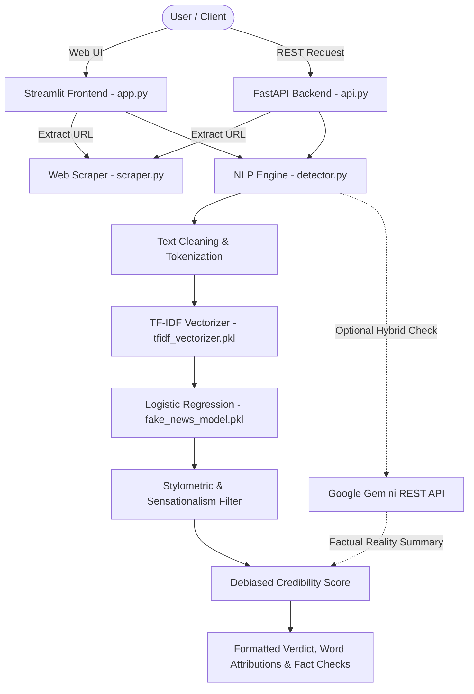

# 📰 Fake News Detection System

[](https://www.python.org/)
[](https://streamlit.io/)
[](https://fastapi.tiangolo.com/)
[](https://scikit-learn.org/)
[](https://aistudio.google.com/)
[](LICENSE)

An explainable, production-ready, and hybrid Machine Learning application designed to detect whether a news article is **Authentic (Real)** or **Fabricated (Fake)**. 

Combines **TF-IDF + Logistic Regression** for offline linguistic pattern recognition with **Google Gemini AI** for semantic fact-checking against real-world knowledge.

---

## 🌟 Key Features

- **⚡ Instant Real vs. Fake Prediction**: Classifies articles with confidence probabilities and a debiased **Credibility Score** (0–100%).
- **🔍 Explainable AI (XAI)**:
  - **Influential Keyword Badges**: Displays words that pulled the classification toward Real (green) or Fake (red).
  - **Interactive Word-Level Highlighting**: Visualizes the exact attention of the model within the text body.
- **✨ Hybrid AI Fact-Checking (Google Gemini)**: Cross-verifies claims against real-world facts with natural language explanations and verdicts (`Real News`, `Fake News`, or `Unverified`).
- **📊 Stylometric & Sensationalism Analysis**:
  - Detects ALL-CAPS text abuse, punctuation exaggeration (e.g. `???`, `!!!`), and sensational clickbait triggers.
  - Mitigates dataset wire-service shortcuts (such as the presence or absence of "Reuters" datelines).
- **🔗 Live Web URL Scraper**: Paste any public news article link to automatically extract the headline, body text, domain, and author metadata.
- **🚀 Dual Interface (Streamlit UI + FastAPI Backend)**:
  - **Streamlit Web App**: Clean, responsive, and mobile-friendly user interface.
  - **FastAPI REST API**: High-performance RESTful API with automated OpenAPI / Swagger documentation for integrations.
- **🌐 Quick Verification Links**: One-click direct search on **Google Fact Check Tools** and **Snopes.com**.
- **🎓 Viva & Presentation Ready**: In-app educational guides explaining NLP preprocessing, TF-IDF weighting, and Logistic Regression decision boundaries.

---

## 🏗️ System Architecture



---

## 🚀 Getting Started

### 1. Clone the Repository
```bash
git clone https://github.com/abhinavsinghrajput645/FakeNewsDetector.git
cd FakeNewsDetector
```

### 2. Create and Activate a Virtual Environment
```bash
# Windows
python -m venv venv
venv\Scripts\activate

# macOS / Linux
python3 -m venv venv
source venv/bin/activate
```

### 3. Install Dependencies
```bash
pip install -r requirements.txt
```

### 4. Configure Google Gemini API Key (Optional)
Gemini AI semantic verification is optional. If left unconfigured, the application runs entirely offline using the local Scikit-Learn model.

To enable AI verification, copy `.env.example` to `.env` and insert your free Gemini API key:
```bash
cp .env.example .env
```
Inside `.env`:
```env
GEMINI_API_KEY=your_gemini_api_key_here
```
> 💡 *Get a free API key at [Google AI Studio](https://aistudio.google.com/). You can also enter the key directly in the web app settings.*

---

## 🖥️ Running the Application

### Option A: Launch the Streamlit Web Application
```bash
streamlit run app.py
```
Open your browser at `http://localhost:8501`.

### Option B: Launch the FastAPI REST Server
```bash
uvicorn api:app --reload --port 8000
```
Interactive API Swagger documentation is available at: `http://localhost:8000/docs`.

---

## 📡 REST API Reference

| Method | Endpoint | Description |
|---|---|---|
| `POST` | `/predict` | Complete text or URL analysis (Credibility score, probabilities, attributions, stylometrics, optional Gemini). |
| `POST` | `/verify` | Direct semantic claim verification using Google Gemini AI. |
| `POST` | `/scrape` | Extract clean text, title, and metadata from an article URL. |
| `GET` | `/features` | Retrieve top predictive model words and coefficients. |
| `GET` | `/gemini/status` | Check if Gemini API key is configured in backend environment. |
| `GET` | `/health` | Health check endpoint returning model type and vocabulary size. |

### Sample API Request (`POST /predict`):
```json
{
  "text": "The Federal Reserve held interest rates steady on Wednesday, citing progress on inflation.",
  "verify_with_gemini": false
}
```

### Sample API Response:
```json
{
  "prediction": "REAL NEWS",
  "is_real": true,
  "confidence": 98.0,
  "credibility_score": 98.0,
  "prob_real": 97.4,
  "prob_fake": 2.6,
  "top_real_words": [
    {"token": "wednesday", "score": 0.81},
    {"token": "rates", "score": 0.35}
  ],
  "top_fake_words": [],
  "stylometrics": {
    "sensationalism_score": 0.0,
    "all_caps_count": 0,
    "exclamation_count": 0
  }
}
```

---

## 🧠 How the Machine Learning Model Works

1. **Text Preprocessing**: Lowercases, removes HTML artifacts, strips redundant whitespace.
2. **TF-IDF Vectorization** (*Term Frequency - Inverse Document Frequency*):
   - Computes sublinear term frequencies across unigrams and bigrams (`ngram_range=(1, 2)`).
   - Maps 5,000 top vocabulary tokens based on document importance.
3. **Logistic Regression Classification**:
   - Computes linear combination $z = w^T x + b$ passed through sigmoid $\sigma(z) = \frac{1}{1 + e^{-z}}$.
   - Class 1 = Authentic / Real News
   - Class 0 = Fabricated / Fake News
4. **Debiasing & Stylometric Layer**:
   - Benchmark datasets often contain wire-service shortcuts (e.g. articles containing "Reuters" or weekday datelines are overwhelmingly labeled Real).
   - The engine audits stylometrics (exclamations, sensational clickbait keywords, ALL-CAPS ratios) and applies a debiased calibration to prevent false positives on neutral facts.

---

## 🧪 Training & Evaluation

The repository includes reproducible pipelines to retrain models or audit wire-service bias:

- **Retrain the Classifier**:
  ```bash
  python train.py --model logistic --clean-bias --out .
  ```
- **Run the Wire-Service Bias Audit**:
  ```bash
  python evaluate.py --model fake_news_model.pkl --tfidf tfidf_vectorizer.pkl
  ```

---

## 📁 Project Structure

```
FakeNewsDetection/
│
├── app.py                 # Streamlit web application (Responsive, Dark Theme & Explainable UI)
├── api.py                 # FastAPI production REST backend (CORS, OpenAPI, Lifespan)
├── detector.py            # NLP engine, stylometrics, debias scoring & Gemini AI client
├── scraper.py             # Web article scraper and metadata extractor (BeautifulSoup)
├── train.py               # Reproducible ML training pipeline (TF-IDF + Classifiers)
├── evaluate.py            # Model evaluation suite and wire-bias shortcut auditor
├── dataset_utils.py       # Benchmark dataset loader and dateline regex scrubber
├── fake_news_model.pkl    # Serialized Scikit-Learn Logistic Regression model
├── tfidf_vectorizer.pkl   # Serialized Scikit-Learn TF-IDF vectorizer
├── requirements.txt       # Production dependencies
├── .env.example           # Example environment template for Gemini API key
├── .gitignore             # Git ignore file (excludes secrets, .venv, bytecode)
└── README.md              # Project documentation
```

---

## 📜 License

This project is licensed under the [MIT License](LICENSE). Built for education, digital literacy, and AI transparency.
